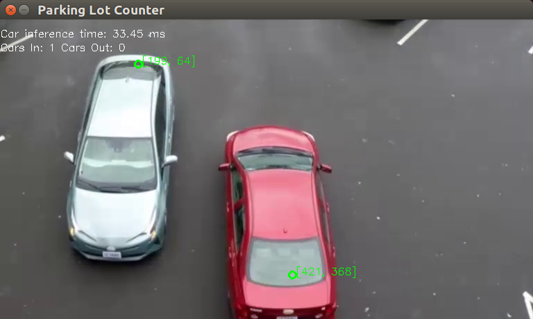

# Parking Lot Counter

| Details            |              |
|-----------------------|---------------|
| Target OS:            |  Ubuntu\* 16.04 LTS   |
| Programming Language: |  C++ |
| Time to Complete:     |  45 min     |



## Introduction

The parking lot counter is one of a series of reference implementations for Computer Vision (CV) using the Intel® Distribution of OpenVINO™ toolkit. This application is designed for a parking space area mounted camera which monitors available parking space by tracking the counts of the vehicles entering and leaving the parking space area.

This example is intended to demonstrate how to use CV to monitor parking spaces in dedicated parking area.

## Requirements

### Hardware
* 6th Generation Intel® Core™ processor with Intel® Iris® Pro graphics and Intel® HD Graphics

### Software
* [Ubuntu\* 16.04 LTS](http://releases.ubuntu.com/16.04/)
*Note*: You must be running kernel version 4.7+ to use this software. We recommend using a 4.14+ kernel to use this software. Run the following command to determine your kernel version:
```
uname -a
```
* OpenCL™ Runtime Package
* Intel® Distribution of OpenVINO™ toolkit

## Setup

### Install the Intel® Distribution of OpenVINO™ toolkit
Refer to https://software.intel.com/en-us/articles/OpenVINO-Install-Linux for more information about how to install and setup the Intel® Distribution of OpenVINO™ toolkit.

You will need the OpenCL™ Runtime package if you plan to run inference on the GPU as shown by the
instructions below. It is not mandatory for CPU inference.

## How it Works

The application uses a video source, such as a camera, to grab frames, and then uses a Deep Neural Network (DNNs) to process the data. The network detects vehicles in the frame, and then if successful it tracks the vehicles leaving and entering the parking area adjusting the counts of the vehicles in the parking area thus providing the information about the available parking spaces.

The data can then optionally be sent to a MQTT machine to machine messaging server, as part of a parking space data analytics system.

The DNN model used in this application is an Intel® optimized models that is part of the Intel® Distribution of OpenVINO™ toolkit.

You can find them here:

- `/opt/intel/computer_vision_sdk/deployment_tools/intel_models/pedestrian-and-vehicle-detector-adas-0001


The program creates three threads for concurrency:

- main thread that performs the video i/o
- worker thread that processes video frames using DNNs
- worker thread that publishes any MQTT messages

## Setting the Build Environment

You must configure the environment to use the Intel® Distribution of OpenVINO™ toolkit one time per session by running the following command:
```
    source /opt/intel/computer_vision_sdk/bin/setupvars.sh
```

## Building the Code

Start by changing the current directory to wherever you have git cloned the application code. For example:
```
    cd parking-lot-counter-cpp
```

If you do not yet have a `build` directory create one:
```
    mkdir build
```

Then change to that directory:
```
    cd build
```

Now run the following commands:
```
    cmake ..
    make
```

Once the commands are finished, you should have built the `monitor` application executable.

## Running the Code

To see a list of the various options:
```
    ./monitor -help
```

To run the application with the needed models using the webcam:
```
    ./monitor -m=/opt/intel/computer_vision_sdk/deployment_tools/intel_models/pedestrian-and-vehicle-detector-adas-0001/FP32/pedestrian-and-vehicle-detector-adas-0001.bin -c=/opt/intel/computer_vision_sdk/deployment_tools/intel_models/pedestrian-and-vehicle-detector-adas-0001/FP32/pedestrian-and-vehicle-detector-adas-0001.xml
```

To control the position of the parking entrance/exit use the `-entrance, -e` command line flag, like this:
```
    ./monitor -m=/opt/intel/computer_vision_sdk/deployment_tools/intel_models/pedestrian-and-vehicle-detector-adas-0001/FP32/pedestrian-and-vehicle-detector-adas-0001.bin -c=/opt/intel/computer_vision_sdk/deployment_tools/intel_models/pedestrian-and-vehicle-detector-adas-0001/FP32/pedestrian-and-vehicle-detector-adas-0001.xml -e="b"
```

The `-entrance` flag controls which part of the video stream frame is to be used for counting the cars entering and exiting the parking lot:
* `"b"`: bottom
* `"l"`: left
* `"r"`: right
* `"t"`: top

To control the car detection DNN confidence level use the `-carconf, -cc` flag eg. `-carconf=0.6` will track all cars whose DNN detection confidence level is higher than `60%`.

The calculations made to track movement using centroids have two parameters that can be set via flags. `--max_distance` set the maximum distance in pixels between two related centroids. In other words how big of a distance of movement between frames show be allowed before assuming that the object is a different vehicle. `--max_frames_gone` is the maximum number of frames to track a centroid which doesn't change, possibly due to being a parked vehicle.

### Hardware Acceleration

This application can take advantage of the hardware acceleration in the Intel® Distribution of OpenVINO™ toolkit by using the `-b` and `-t` parameters.

For example, to use the Intel® Distribution of OpenVINO™ toolkit backend with the GPU in 32-bit mode:
```
    ./monitor -m=/opt/intel/computer_vision_sdk/deployment_tools/intel_models/pedestrian-and-vehicle-detector-adas-0001/FP32/pedestrian-and-vehicle-detector-adas-0001.bin -c=/opt/intel/computer_vision_sdk/deployment_tools/intel_models/pedestrian-and-vehicle-detector-adas-0001/FP32/pedestrian-and-vehicle-detector-adas-0001.xml -b=2 -t=1
```

To run the code using 16-bit floats, you have to both set the `-t` flag to use the GPU in 16-bit mode, as well as use the FP16 version of the Intel® models:
```
    ./monitor -m=/opt/intel/computer_vision_sdk/deployment_tools/intel_models/pedestrian-and-vehicle-detector-adas-0001/FP16/pedestrian-and-vehicle-detector-adas-0001.bin -c=/opt/intel/computer_vision_sdk/deployment_tools/intel_models/pedestrian-and-vehicle-detector-adas-0001/FP16/pedestrian-and-vehicle-detector-adas-0001.xml -b=2 -t=2
```

To run the code using the VPU, you have to set the `-t` flag to `3` and also use the 16-bit FP16 version of the Intel® models:
```
    ./monitor -m=/opt/intel/computer_vision_sdk/deployment_tools/intel_models/pedestrian-and-vehicle-detector-adas-0001/FP16/pedestrian-and-vehicle-detector-adas-0001.bin -c=/opt/intel/computer_vision_sdk/deployment_tools/intel_models/pedestrian-and-vehicle-detector-adas-0001/FP16/pedestrian-and-vehicle-detector-adas-0001.xml -b=2 -t=3
```

## Sample Videos

There are several videos available to use as sample videos to show the capabilities of this application. You can download them by running these commands from the `parking-lot-counter-cpp` directory:
```
    mkdir resources
    cd resources
    wget https://github.com/intel-iot-devkit/sample-videos/raw/master/car-detection.mp4
    cd ..
```

To then execute the code using one of these sample videos, run the following commands from the `parking-lot-counter-cpp` directory:
```
    cd build
    ./monitor -m=/opt/intel/computer_vision_sdk/deployment_tools/intel_models/pedestrian-and-vehicle-detector-adas-0001/FP32/pedestrian-and-vehicle-detector-adas-0001.bin -c=/opt/intel/computer_vision_sdk/deployment_tools/intel_models/pedestrian-and-vehicle-detector-adas-0001/FP32/pedestrian-and-vehicle-detector-adas-0001.xml -i=../resources/car-detection.mp4 -cc=0.7 -e="b"
```

The above command will use the bottom edge of the video stream frame as parking lot entrance and will count the cars driving up the frame as the cars entering the parking lot and the cars driving down the frame as the cars leaving the parking lot. The application displays in real time how many cars have entered and exited the parking lot.

### Machine to Machine Messaging with MQTT

If you wish to use a MQTT server to publish data, you should set the following environment variables before running the program:
```
    export MQTT_SERVER=localhost:1883
    export MQTT_CLIENT_ID=cvservice
```

Change the `MQTT_SERVER` to a value that matches the MQTT server you are connecting to.

You should change the `MQTT_CLIENT_ID` to a unique value for each monitoring station, so you can track the data for individual locations. For example:
```
    export MQTT_CLIENT_ID=parkinglot1337
```
