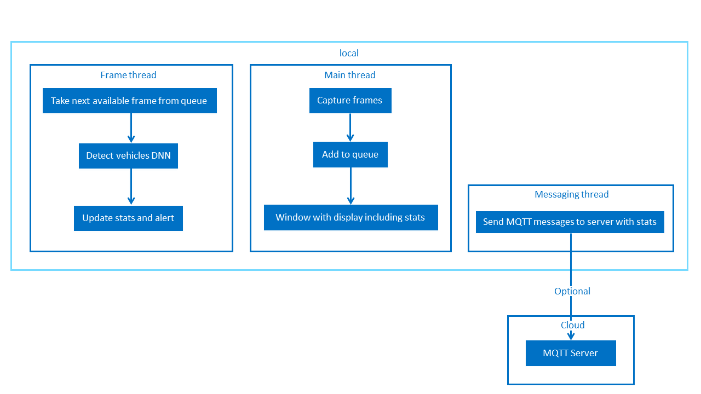

# Parking Lot Counter

| Details            |              |
|-----------------------|---------------|
| Target OS:            |  Ubuntu\* 18.04 LTS   |
| Programming Language: |  C++ |
| Time to Complete:     |  45 min     |


## Introduction

This reference implementations is designed for a parking space area with mounted camera which monitors available parking space by tracking the count of the vehicles entering and leaving the parking space area.

## Requirements

### Hardware
* 6th to 8th Generation Intel® Core™ processors with Intel® Iris® Pro graphics or Intel® HD Graphics

### Software
* [Ubuntu\* 18.04 LTS](http://releases.ubuntu.com/18.04/)<br>
  **Note**: We recommend using a 4.14+ kernel to use this software. Run the following command to determine your kernel version:
  ```
    uname -a
  ```
  
* OpenCL™ Runtime Package
* Intel® Distribution of OpenVINO™ toolkit 2020 R3 Release

## How it Works

The application uses a video source, such as a camera, to grab frames, and then uses a Deep Neural Network (DNNs) to process the data. The network detects vehicles in the frame and then if successful it tracks the vehicles leaving or entering the parking area and adjusts the count of the vehicles in the parking area for providing the information about the available parking spaces.

The data can then optionally be sent to a MQTT machine to machine messaging server, as part of a parking space data analytics system.



The program creates three threads for concurrency:

- Main thread that performs the video I/O
- Worker thread that processes video frames using DNNs
- Worker thread that publishes any MQTT messages


## Setup
### Get the code
Clone the reference implementation:
```
sudo apt-get update && sudo apt-get install git
git clone https://github.com/intel-iot-devkit/parking-lot-counter-cpp.git 
```

### Install OpenVINO
Refer to https://software.intel.com/en-us/articles/OpenVINO-Install-Linux for more information about how to install and setup the Intel® Distribution of OpenVINO™ toolkit.

You will need the OpenCL™ Runtime package if you plan to run inference on the GPU as shown by the
instructions below. It is not mandatory for CPU inference.

## Other dependencies
**Mosquitto**<br>

Mosquitto is an open source message broker that implements the MQTT protocol. The MQTT protocol provides a lightweight method of carrying out messaging using a publish/subscribe model. 

## Which model to use

This application uses the [pedestrian-and-vehicle-detector-adas-0001](https://docs.openvinotoolkit.org/2020.3/_models_intel_pedestrian_and_vehicle_detector_adas_0001_description_pedestrian_and_vehicle_detector_adas_0001.html) Intel® model, that can be downloaded using the **model downloader**. The **model downloader** downloads the __.xml__ and __.bin__ files that will be used by the application.

To download the models and install the dependencies of the application, run the below command in the `parking-lot-counter-cpp` directory:
```
./setup.sh
```

### The Config File

The _resources/config.json_ contains the path of video that will be used by the application as input.

For example:
   ```
   {
       "inputs": [
          {
              "video":"path_to_video/video1.mp4"
          }
       ]
   }
   ```

The `path/to/video` is the path to an input video file.

### Which Input Video to use

The application works with any input video. Sample videos are provided [here](https://github.com/intel-iot-devkit/sample-videos/).

For first-use, we recommend using the [car-detection.mp4](https://github.com/intel-iot-devkit/sample-videos/blob/master/car-detection.mp4) video.
For example:
   ```
   {
       "inputs": [
          {
              "video":"sample-videos/car-detection.mp4"
          }
       ]
   }
   ```
If the user wants to use any other video, it can be used by providing the path in the config.json file.

### Using the Camera Stream instead of video

Replace `path/to/video` with the camera ID in the config.json file, where the ID is taken from the video device (the number **X** in /dev/video**X**).

On Ubuntu, to list all available video devices use the following command:

```
ls /dev/video*
```

For example, if the output of above command is __/dev/video0__, then config.json would be:

```
  {
     "inputs": [
        {
           "video":"0"
        }
     ]
   }
```

### Setup the Environment

Configure the environment to use the Intel® Distribution of OpenVINO™ toolkit by exporting environment variables:

```
source /opt/intel/openvino/bin/setupvars.sh
```

__Note__: This command needs to be executed only once in the terminal where the application will be executed. If the terminal is closed, the command needs to be executed again.

### Build the application

To build, go to the `parking-lot-counter-cpp` and run the following commands:

```
mkdir -p build && cd build
cmake ..
make 
```

## Run the application

To see a list of the various options:
```
./monitor -help
```

### Run on the CPU
To run the application with the required models using webcam, execute the below command:
```
./monitor -m=/opt/intel/openvino/deployment_tools/open_model_zoo/tools/downloader/intel/pedestrian-and-vehicle-detector-adas-0001/FP32/pedestrian-and-vehicle-detector-adas-0001.bin -c=/opt/intel/openvino/deployment_tools/open_model_zoo/tools/downloader/intel/pedestrian-and-vehicle-detector-adas-0001/FP32/pedestrian-and-vehicle-detector-adas-0001.xml
```

To control the position of the parking entrance/exit use the `-entrance, -e` command line flag. For example:
```
./monitor -m=/opt/intel/openvino/deployment_tools/open_model_zoo/tools/downloader/intel/pedestrian-and-vehicle-detector-adas-0001/FP32/pedestrian-and-vehicle-detector-adas-0001.bin -c=/opt/intel/openvino/deployment_tools/open_model_zoo/tools/downloader/intel/pedestrian-and-vehicle-detector-adas-0001/FP32/pedestrian-and-vehicle-detector-adas-0001.xml -e="b"
```

The `-entrance` flag controls which part of the video stream frame has to be used for counting the cars entering or exiting the parking lot:
* `"b"`: bottom
* `"l"`: left
* `"r"`: right
* `"t"`: top

To control the car detection DNN confidence level, use the `-carconf, -cc` flag. For example, `-carconf=0.6` will track all cars whose DNN detection confidence level is higher than `60%`.

The calculations made to track the movement of vehicles using centroids have two parameters that can be set via command line flags. `--max_distance` set the maximum distance in pixels between two related centroids. In other words, how big of a distance of movement between frames show be allowed before assuming that the object is a different vehicle. `--max_frames_gone` is the maximum number of frames to track a centroid which doesn't change, possibly due to being a parked vehicle.

### Run on the Integrated GPU

This application can take advantage of the hardware acceleration in the Intel® Distribution of OpenVINO™ toolkit by using the `-b` and `-t` parameters.

- To run the application on the integrated Intel® GPU in 32-bit mode, use the below command:
    ```
    ./monitor -m=/opt/intel/openvino/deployment_tools/open_model_zoo/tools/downloader/intel/pedestrian-and-vehicle-detector-adas-0001/FP32/pedestrian-and-vehicle-detector-adas-0001.bin -c=/opt/intel/openvino/deployment_tools/open_model_zoo/tools/downloader/intel/pedestrian-and-vehicle-detector-adas-0001/FP32/pedestrian-and-vehicle-detector-adas-0001.xml -b=2 -t=1
    ```
    **FP32**: FP32 is single-precision floating-point arithmetic uses 32 bits to represent numbers. 8 bits for the magnitude and 23 bits for the precision. For more information, [click here](https://en.wikipedia.org/wiki/Single-precision_floating-point_format)<br>

- To run the application on the integrated Intel® GPU in 16-bit mode, use the below command:
    ```
    ./monitor -m=/opt/intel/openvino/deployment_tools/open_model_zoo/tools/downloader/intel/pedestrian-and-vehicle-detector-adas-0001/FP16/pedestrian-and-vehicle-detector-adas-0001.bin -c=/opt/intel/openvino/deployment_tools/open_model_zoo/tools/downloader/intel/pedestrian-and-vehicle-detector-adas-0001/FP16/pedestrian-and-vehicle-detector-adas-0001.xml -b=2 -t=2
    ```
    **FP16**: FP16 is half-precision floating-point arithmetic uses 16 bits. 5 bits for the magnitude and 10 bits for the precision. For more information, [click here](https://en.wikipedia.org/wiki/Half-precision_floating-point_format)<br>

### Run on the Intel® Neural Compute Stick

To run the application using the Intel® Neural Compute Stick, use the below command:
```
./monitor -m=/opt/intel/openvino/deployment_tools/open_model_zoo/tools/downloader/intel/pedestrian-and-vehicle-detector-adas-0001/FP16/pedestrian-and-vehicle-detector-adas-0001.bin -c=/opt/intel/openvino/deployment_tools/open_model_zoo/tools/downloader/intel/pedestrian-and-vehicle-detector-adas-0001/FP16/pedestrian-and-vehicle-detector-adas-0001.xml -b=2 -t=3
```

### Machine to Machine Messaging with MQTT

#### Install Mosquitto Broker
```
sudo apt-get update
sudo apt-get install mosquitto mosquitto-clients
```

If you wish to use a MQTT server to publish data, you should set the following environment variables before running the program:
```
export MQTT_SERVER=localhost:1883
export MQTT_CLIENT_ID=cvservice
```

Change the `MQTT_SERVER` to a value that matches the MQTT server you are connecting to.

You should change the `MQTT_CLIENT_ID` to a unique value for each monitoring station, so you can track the data for individual locations. For example:
```
export MQTT_CLIENT_ID=parkinglot1337
```

If you want to monitor the MQTT messages sent to your local server, and you have the mosquitto client utilities installed, you can run the following command on a new terminal while the application is running:
```
mosquitto_sub -t 'parking/counter'
```

